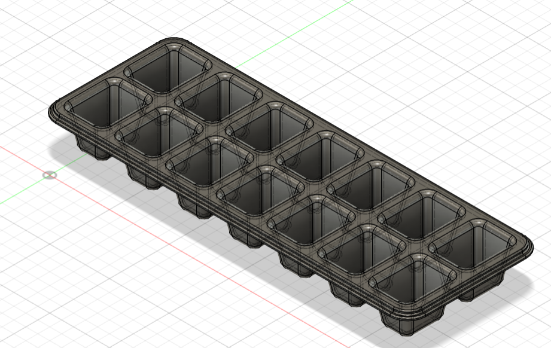

Practice 3D design projects in Fusion 360, to aid building experience for enclosure/housing designs.

<table>
  <tr>
    <td align="center">
      
       M3 Screw
    </td>
    <td align="center">
      
       Toy Block
    </td>
    <td align="center">
      
       Crystal
    </td>
  </tr>
  <tr>
    <td align="center">
      
       Loft Bottle
    </td>
    <td align="center">
      
       Paper Clip
    </td>
    <td align="center">
      
       Ice Tray
    </td>
  </tr>
</table>
