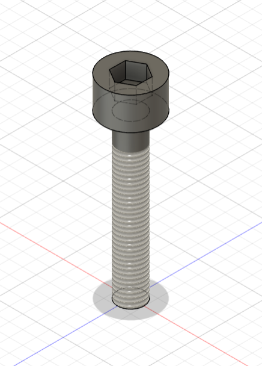
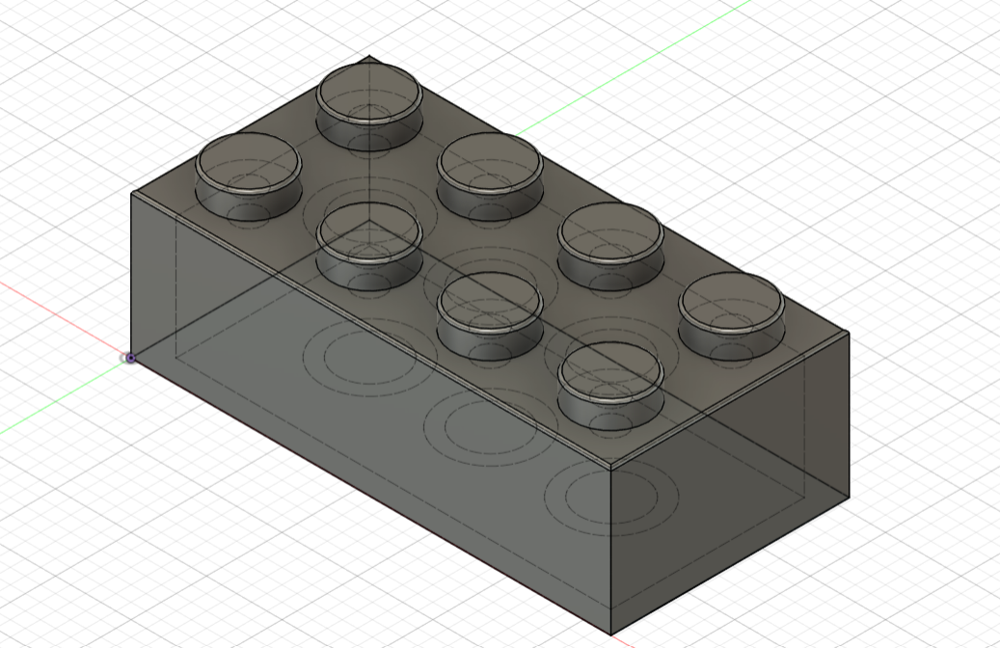
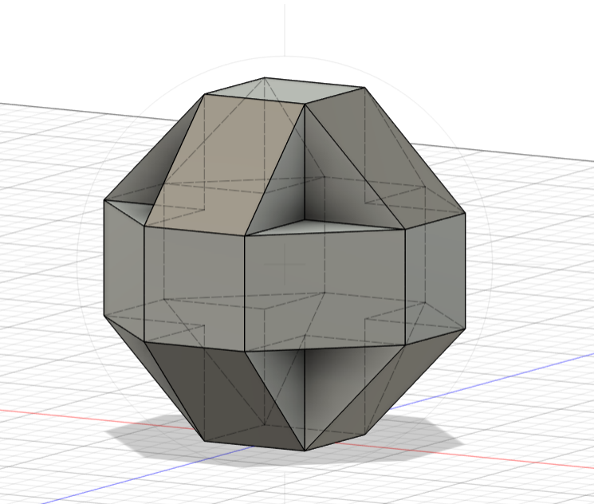
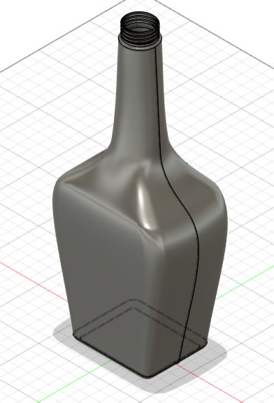
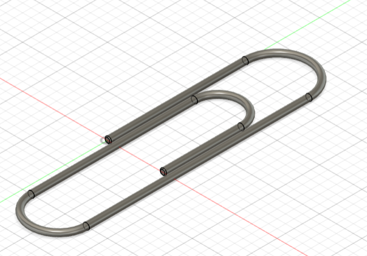

Practice 3D design projects in Fusion 360 to build experience in enclosure and housing design.

  

    

      
       M3 Screw
    

    

      
       Toy Block
    

  

  

    

      
       Crystal
    

    

      
       Loft Bottle
    

  

  

    

      
       Paper Clip
    

    

      
       Ice Tray
    

  

