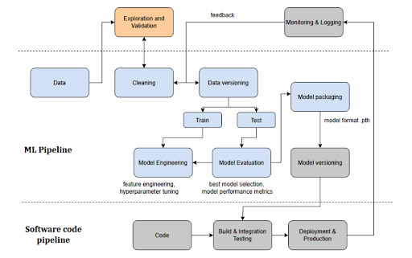
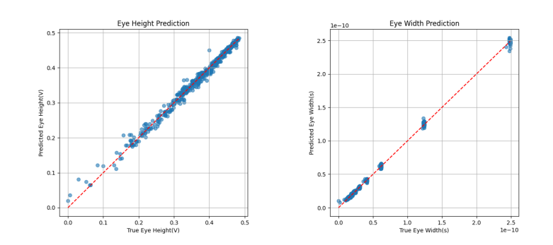

# ML-and-EMC
ML and EMC projects with respect to electronic product development

#### Research Project | TET TUHH
* Generated data through ADS simulation
* Conducted Exploratory Data Analysis (EDA)
* Built and compared ML models for the general prediction of eye diagrams for SI verification of high speed PCB interconnections 
Experience:  Signal Integrity, Literature review, ML workflow, ADS, MATLAB, Typst, PyTorch, VS Code, Git, Latex

----

*Machine Learning and Software Code Pipeline*

----

*Prediction of Eye height & Width*

